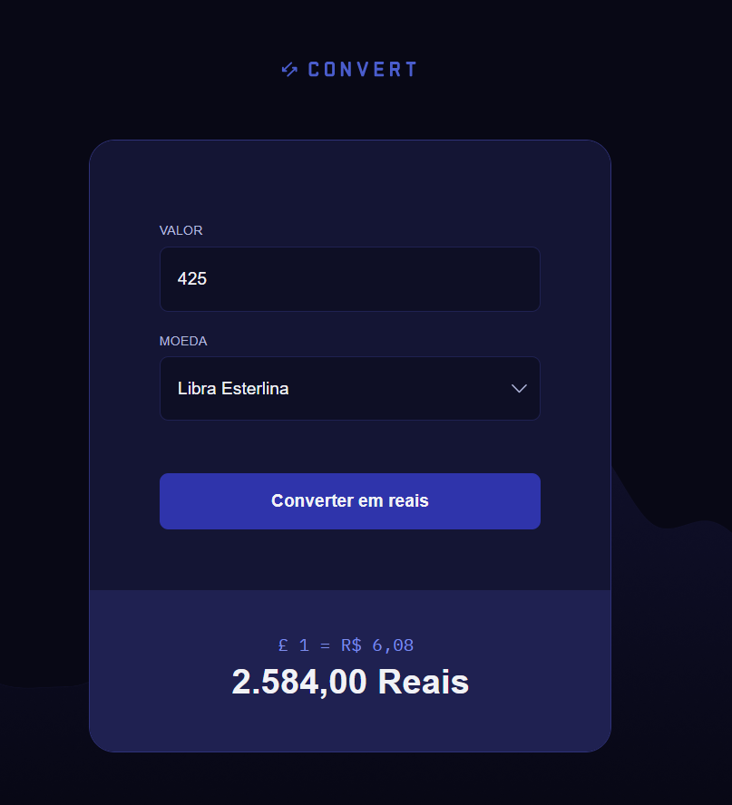

# Projeto conversor de moedas
Utilizando apenas javascript puro foi desenvolvida esta aplicação para calcular/converter moedas como dolar americano, euro e libra para reais.

Para incrementar o projeto, fiz a integração com a api pública <https://economia.awesomeapi.com.br> 

Demo: <https://tiagomartinscc.github.io/convert>

